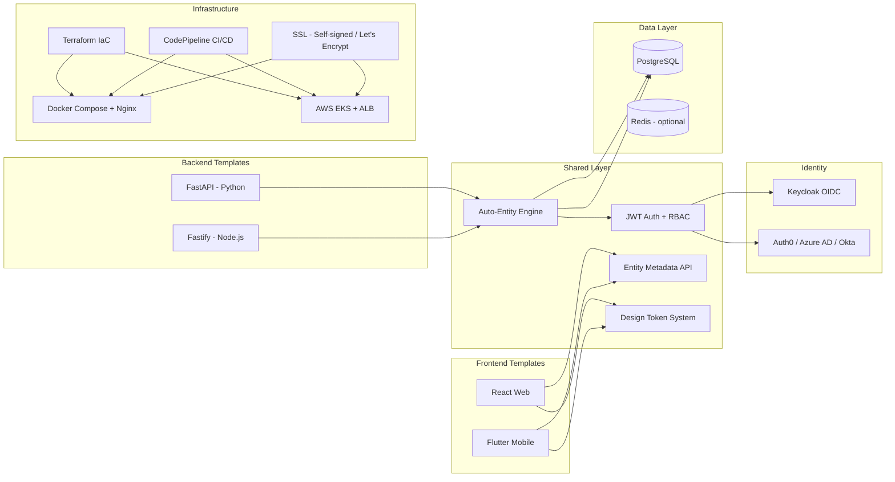

# Projx — Proposal

---

## Overview

Projx is a production-grade, multi-stack application foundation. It provides backend templates (FastAPI, Fastify), frontend templates (React SPA + SSR/SSG, Flutter), and a shared infrastructure layer (Docker Compose + Nginx, Kubernetes on AWS) — all wired with authentication, auto-entity CRUD, CI/CD, and end-to-end testing.

For any new SaaS product or enterprise application, the team picks a backend and frontend stack, runs an init script, defines entity models, and has a deployable application with auth, CRUD, and CI/CD pipeline within 2 weeks. The FastAPI + React SPA combination is already built and functional. This proposal covers building out the remaining stacks and hardening the system for production client use.

**Scope included:**

- Backend templates: FastAPI (built), Fastify
- Frontend templates: React (built, SPA + SSR/SSG via React Router v7), Flutter
- Shared auto-entity CRUD engine pattern across all backend stacks
- Shared design token system and theming across all frontend stacks
- JWT auth with pluggable providers (Keycloak, Auth0, Azure AD, Okta) — shared across all stacks
- Infrastructure: Docker Compose + Nginx (simple), Kubernetes on AWS EKS (enterprise)
- SSL: self-signed for dev, Let's Encrypt auto-provisioning for production
- Terraform IaC for AWS with per-environment configs
- CI/CD pipelines (AWS CodePipeline) with change-aware deploys
- Testing infrastructure per stack (unit, E2E, coverage enforcement)
- Project initialization script (pick stack, configure, wire, deploy)
- Developer onboarding documentation

**Deferred / Out of scope:**

- Client-specific business logic — added per project on top of templates
- Multi-tenancy — architecture supports it but requires per-project configuration
- Observability stack (Grafana, Prometheus) — documented but not bundled
- Payment/billing integrations — too project-specific to generalize
- Desktop app templates (Electron, Tauri)
- GraphQL — REST-only for now; can be added as a future stack option

---

## Architecture Overview

**Key architectural decisions:**

1. **Stack-agnostic auto-entity pattern** — the same "define a model, get CRUD" workflow works across FastAPI and Fastify. Each backend implements the pattern idiomatically but exposes the same `/_meta` contract for frontend consumption.
2. **Shared design token system** — all frontend stacks use the same 70+ CSS tokens (web) or equivalent theme constants (Flutter), ensuring visual consistency regardless of frontend choice.
3. **Pluggable auth across all stacks** — JWT verification with four provider modes works identically in Python and Node.js backends. Keycloak is the default, but any OIDC provider works without code changes.
4. **Two infrastructure modes from one Terraform codebase** — Docker Compose + Nginx for simple/cheap deployments, EKS for enterprise scale. SSL auto-provisions in both modes.
5. **Mix-and-match** — any backend can pair with any frontend. Fastify + Flutter, FastAPI + React SSR, Fastify + React SPA — all combinations work because the contract (`/_meta`, auth, error formats) is standardized.

---

## Tech Stack

| Layer             | Technology                                               | Purpose                                                  |
| ----------------- | -------------------------------------------------------- | -------------------------------------------------------- |
| Backend (Python)  | FastAPI 0.116+, SQLAlchemy 2.0, Alembic, Pydantic v2, UV | Async REST API for AI/ML and Python-heavy projects       |
| Backend (Node.js) | Fastify v4+, Prisma, TypeBox, pnpm                       | High-performance REST API for general web projects       |
| Frontend (Web)    | React 19, TypeScript 5.7, Vite 6, React Router v7        | SPA default, SSR/SSG via React Router v7 framework mode  |
| Frontend (Mobile) | Flutter 3.x, Riverpod, GoRouter, Dio                     | Cross-platform mobile (iOS + Android)                    |
| Design System     | CSS Custom Properties (web), ThemeData (Flutter)         | 70+ tokens: colors, spacing, typography, shadows, themes |
| Auth              | Keycloak, PyJWT, @fastify/jwt                            | OIDC, JWT verification, RBAC across all stacks           |
| Database          | PostgreSQL 16                                            | Primary data store for all stacks                        |
| ORM (Python)      | SQLAlchemy 2.0 async                                     | Async DB access with asyncpg                             |
| ORM (Node.js)     | Prisma                                                   | Type-safe DB access with generated types                 |
| Testing (Python)  | pytest, pytest-asyncio, Faker                            | Backend unit + integration tests                         |
| Testing (Node.js) | Vitest, fastify.inject()                                 | Backend unit + integration tests                         |
| Testing (React)   | Vitest, testing-library, Playwright                      | Unit + E2E tests                                         |
| Testing (Mobile)  | flutter_test, integration_test                           | Unit + integration tests                                 |
| Containerization  | Docker, Docker Compose, Nginx                            | Production and development environments                  |
| IaC               | Terraform 1.11+                                          | AWS infrastructure (VPC, RDS, EKS, EC2, ECR)             |
| CI/CD             | AWS CodePipeline + CodeBuild                             | Change-aware build and deploy pipelines                  |
| SSL               | Let's Encrypt, self-signed                               | Auto-provisioning based on domain availability           |
| Logging           | Loguru (Python), Pino (Node.js)                          | Structured JSON logging with request ID correlation      |

---

## Feature Requirements

### 1. FastAPI Backend Template

- Auto-entity discovery engine: drop `_model.py` in `entities/<name>/`, get full CRUD
- SQLAlchemy 2.0 async with auto-generated Pydantic v2 schemas
- Alembic migrations with auto-detection
- Middleware stack: CORS, RequestID, AuthN, AuthZ
- Scaffolding CLI: `scaffold.py` generates entities, tests, optional controllers
- pytest + pytest-asyncio with BaseEntityApiTest (11 reusable CRUD test methods)
- Loguru structured logging with request ID correlation
- **Status: Built — needs hardening and edge case coverage**

### 2. Fastify Backend Template

- Plugin-based architecture with auto-route loading
- Prisma ORM with TypeBox schema generation
- Entity module pattern mirroring FastAPI's auto-discovery (routes, schemas, handlers, service, repository)
- Centralized error handler plugin (Prisma errors, NotFoundError, BusinessRuleError)
- @fastify/swagger for auto-generated OpenAPI docs
- Vitest + `fastify.inject()` with reusable CRUD test methods
- Pino structured logging (Fastify built-in)
- **Status: Not built — new development**

### 3. React Frontend Template (SPA + SSR/SSG)

- Auto-entity UI from backend `/_meta` endpoint
- EntityTable (paginated, debounced search, sort, filter), EntityForm (dynamic from metadata)
- Toast, ConfirmDialog (promise-based), ErrorBoundary
- React Router v7 with dashboard, login, entity CRUD pages, 404
- SSR/SSG capability via React Router v7 framework mode (loader functions, prerendering, SEO metadata)
- CSS design token system (70+ tokens), light/dark theme
- Responsive layout with collapsible sidebar
- Override system (`overrides.ts`) for per-entity customization
- Vitest + testing-library unit tests, Playwright E2E
- **Status: SPA built — needs SSR mode, polish, and accessibility hardening**

### 4. Flutter Mobile Template

- Material Design 3 with custom theme system matching web design tokens
- Riverpod state management, GoRouter navigation
- Dio HTTP client with token refresh interceptor
- Auto-entity screens from `/_meta` (list, detail, form — same pattern as web)
- Secure token storage (flutter_secure_storage)
- Biometric auth support
- Push notifications (FCM)
- Offline-first with local caching
- **Status: Not built — new development**

### 5. Shared Auth System

- JWT verification with pluggable providers: shared_secret, public_key, JWKS, auto-detect
- Keycloak OIDC as default provider with realm templates per environment
- Permission model `<resource>:<action>.<scope>` — consistent across all backend stacks
- Frontend token refresh on 401 with automatic retry — consistent across all frontend stacks
- Dev mode toggle (`AUTH_ENABLED=false`) injects superuser
- Support for Auth0, Azure AD, Okta via JWKS without code changes

### 6. Design Token System

- 70+ CSS custom properties: backgrounds, text, borders, accent, semantic colors, shadows, spacing, radius, typography, transitions
- Light/dark theme switching via `[data-theme='dark']` (web) or ThemeData (Flutter)
- Theme persistence (localStorage for web, SharedPreferences for mobile)
- WCAG 2.1 AA contrast ratios enforced
- Responsive breakpoints: 640px, 768px, 1024px, 1280px, 1536px
- Equivalent Flutter theme constants mapped from CSS tokens

### 7. Docker Compose + Nginx Infrastructure

- Production compose: migrate (one-shot) → backend → frontend (Nginx with SSL)
- Dev compose: DB → migrate → backend (hot-reload) → frontend (HMR)
- Nginx reverse proxy: API proxying, SPA fallback, gzip, HTTP → HTTPS redirect
- SSL: self-signed auto-generated if no domain; Let's Encrypt auto-provisioned if domain provided
- Auto-renewal cron (daily at 3 AM) for Let's Encrypt certs
- Health checks and restart policies on all services
- Works on any VPS or EC2 instance

### 8. Kubernetes Infrastructure

- AWS EKS with managed node groups and horizontal pod autoscaling
- ALB ingress controller with SSL termination
- Helm charts for Keycloak and application services
- K8s secrets from AWS Secrets Manager
- Namespace isolation per environment
- Rolling deployments with automatic rollback on failure
- Resource limits and requests per pod

### 9. Terraform IaC

- Shared Terraform configs for both deployment modes (Compose and K8s)
- VPC with public, private, and isolated subnets
- RDS PostgreSQL with autoscaling storage and automated backups
- ECR container registry with lifecycle policies
- Per-environment configs (dev/staging/prod) with separate S3 state files
- CLI wrapper (`bin/tf`) with pre-flight validation
- Single variable switch between Compose and K8s modes

### 10. CI/CD Pipeline

- AWS CodePipeline + CodeBuild with per-service buildspecs
- Change-aware deploys: SSM-tracked commit SHA, skip builds if no relevant files changed
- Branch-to-environment mapping: develop → dev, staging → staging, main → prod
- K8s deploy: `kubectl set image` with rollout verification
- Compose deploy: SSM RunCommand to pull and restart on EC2
- ECR image scanning and lifecycle cleanup

### 11. Testing Infrastructure

- Per-stack test setup: pytest (FastAPI), Vitest (Fastify, React), flutter_test (Flutter)
- Reusable base test class with CRUD test methods per stack
- Playwright E2E for all web frontends with auto-entity discovery
- 80% coverage minimum enforced across all stacks
- Test scaffolding CLI per stack
- Safety net ensuring every entity has tests

### 12. Project Initialization

- CLI script: select backend + frontend + infra mode
- Clone appropriate templates, wire them together
- Rename project, configure env files, set up Git repo
- Generate initial docker-compose files for chosen stack
- Validate setup with health check

---

## Delivery Approach

This is an internal project. The FastAPI + React SPA combination is already built. The work is divided into two tracks: (1) building new stack templates (Fastify, Flutter) and (2) hardening existing templates and shared infrastructure.

**Methodology:** 2-week sprints. Each sprint delivers a shippable increment — a complete template or a hardened subsystem. Status sync weekly.

**Team:**

- 2 Backend Developers — one owns Fastify template, one handles FastAPI hardening
- 1 Frontend Developer — React SSR support + SPA polish
- 1 Mobile Developer — Flutter template
- 1 DevOps/QA Engineer — infrastructure hardening, CI/CD, SSL, Terraform, testing infrastructure across all stacks

**Delivery model:** Each template is developed in its own repo following the same structure as `projx`. Shared components (auth, design tokens, Terraform, CI/CD) are maintained centrally. Each template is validated by deploying a sample application with 5 entities covering common patterns (users, products, orders, categories, audit logs).

**Definition of done per template:** Auto-entity CRUD works, auth works, tests pass at 80%+ coverage, deploys successfully on both infra modes, documented.

---

## Estimates

### Dev Estimates

| Category            | Requirement                                                                 |     Low |    High |
| ------------------- | --------------------------------------------------------------------------- | ------: | ------: |
| FastAPI (hardening) | Auto-entity registry edge cases and query engine refinements                |      12 |      15 |
| FastAPI (hardening) | Error handling standardization and metadata enrichment                      |       6 |       8 |
| FastAPI (hardening) | Test coverage push to 90%+ on core engine                                   |       6 |       8 |
| Fastify             | Project setup, plugin architecture, Prisma integration                      |      10 |      13 |
| Fastify             | Auto-entity module pattern (routes, schemas, handlers, service, repository) |      18 |      23 |
| Fastify             | Query engine (pagination, search, filters, sort, FK expansion)              |      12 |      15 |
| Fastify             | Error handler plugin, health check, metadata endpoint                       |       6 |       8 |
| Fastify             | Swagger docs, TypeBox schemas, OpenAPI generation                           |       4 |       5 |
| Fastify             | Test infrastructure (Vitest, base test class, scaffolding)                  |       8 |      10 |
| React (hardening)   | EntityTable and EntityForm polish (responsive, accessibility)               |       8 |      10 |
| React (hardening)   | Design token audit, dark theme QA, WCAG AA validation                       |       6 |       8 |
| React (hardening)   | E2E test expansion (auth flows, error states, mobile viewport)              |       6 |       8 |
| React (SSR/SSG)     | React Router v7 framework mode SSR setup, loader functions, prerendering    |       8 |      10 |
| Flutter             | Project setup, theme system mapped from web tokens                          |       8 |      10 |
| Flutter             | Auto-entity screens (list, detail, form) from `/_meta`                      |      14 |      18 |
| Flutter             | Auth (Keycloak OIDC, secure storage, token refresh, biometric)              |       8 |      10 |
| Flutter             | Navigation (GoRouter), state management (Riverpod)                          |       6 |       8 |
| Flutter             | Offline caching, push notifications (FCM)                                   |       8 |      10 |
| Flutter             | Test infrastructure (flutter_test, integration_test)                        |       6 |       8 |
| Auth (shared)       | Multi-provider testing (Keycloak, JWKS, shared_secret, public_key)          |       4 |       5 |
| Auth (shared)       | Keycloak realm templates finalization, user seeds                           |       4 |       5 |
| Auth (shared)       | Token refresh reliability across all frontend stacks                        |       4 |       5 |
| Design System       | Token system documentation and Flutter mapping                              |       4 |       5 |
| Infra               | Docker Compose + Nginx hardening (health checks, SSL auto-provision)        |       6 |       8 |
| Infra               | Kubernetes mode end-to-end validation with sample app                       |       8 |      10 |
| Infra               | Terraform module hardening (idempotency, destroy/recreate)                  |       6 |       8 |
| Infra               | SSL automation (self-signed fallback, Let's Encrypt, renewal)               |       4 |       5 |
| CI/CD               | Pipeline templates per stack (FastAPI, Fastify, React, Flutter)             |       8 |      10 |
| CI/CD               | Change-aware deploy validation, ECR lifecycle policies                      |       4 |       5 |
| DX                  | Project initialization script (pick stack, wire, configure)                 |      10 |      13 |
| DX                  | Sample application per stack (5 entities)                                   |      12 |      15 |
| DX                  | Developer onboarding documentation per stack                                |       8 |      10 |
|                     | **TOTAL DEV HOURS**                                                         | **242** | **309** |

### Effort Summary

| Type                      |     Low |    High |
| ------------------------- | ------: | ------: |
| Dev Hours                 |     242 |     309 |
| QA Hours                  |      30 |      39 |
| PM Hours                  |      27 |      34 |
| **Total Estimated Hours** | **299** | **382** |

> **Estimate basis:** Low estimate assumes high development efficiency; high estimate accounts for additional complexity and rework. Actual hours will fall within this range. Final hours to be confirmed after discovery.

---

## Indicative Timeline — 8 Weeks

| Period       | Deliverables                                                                                                                                                         |
| ------------ | -------------------------------------------------------------------------------------------------------------------------------------------------------------------- |
| **Week 1-2** | FastAPI hardening (registry, query engine, error handling, tests); React SPA polish (responsive, a11y, dark theme QA); Fastify project setup and plugin architecture |
| **Week 3-4** | Fastify auto-entity engine (module pattern, query engine, error handler, Swagger); Flutter project setup, theme mapping, and auth integration                        |
| **Week 5-6** | Fastify testing and docs; React SSR mode (React Router v7 framework mode, loaders, prerendering); Flutter auto-entity screens (list, detail, form)                   |
| **Week 6-7** | Flutter offline caching, push notifications, testing; Infrastructure hardening (Compose + K8s); CI/CD pipelines per stack                                            |
| **Week 7-8** | SSL automation; Terraform hardening; Auth multi-provider validation; Project initialization script; Sample apps per stack; Documentation                             |

Target duration: **8 weeks** with a team of 5 (2 backend devs, 1 frontend dev, 1 mobile dev, 1 DevOps/QA). FastAPI + React SPA are already built — this timeline covers building Fastify and Flutter templates from scratch, adding React SSR/SSG support, plus hardening everything for production.

---

## Key Risks & Considerations

| Risk                                                                                     | Impact                                                                      | Mitigation                                                                                                                                         |
| ---------------------------------------------------------------------------------------- | --------------------------------------------------------------------------- | -------------------------------------------------------------------------------------------------------------------------------------------------- |
| Fastify auto-entity pattern may not map cleanly from FastAPI's SQLAlchemy-based approach | Core feature gap in the default backend template                            | Prototype the entity registry pattern in Week 1 before committing to full build; Prisma's introspection capabilities differ from SQLAlchemy's      |
| Flutter `/_meta` consumption requires a different UI paradigm than web                   | Mobile template feels like a forced port rather than native                 | Design Flutter entity screens mobile-first with platform-native patterns (pull-to-refresh, swipe actions, bottom sheets) rather than mirroring web |
| Four stack combinations multiply testing and maintenance burden                          | Bug in shared auth breaks all stacks; updates require testing across matrix | Shared contract tests for `/_meta` and auth; each stack has its own CI pipeline; changes to shared layer trigger all pipelines                     |
| Template divergence across client projects                                               | Fixes in client projects don't flow back; template forks drift              | Version-tag template releases; clients fork from tags; establish upstream merge process with quarterly sync                                        |
| EKS mode hasn't been validated end-to-end recently                                       | Deploy failures on first K8s client project                                 | Dedicated EKS validation in Week 7-8 with sample app; document known issues and workarounds                                                        |
| Internal project competes with billable client work for team attention                   | Template becomes "whenever we have time" and stalls                         | Reserve dedicated sprint capacity; treat template work as a product with its own backlog and velocity tracking                                     |
| SSL auto-provisioning logic (self-signed vs Let's Encrypt) adds complexity               | Cert failures during deployment look like app failures                      | Clear decision tree: no domain = self-signed, domain provided = Let's Encrypt; test both paths in CI                                               |
